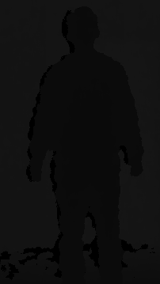
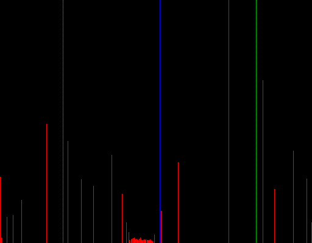

# Depth map Histogram visualization :robot:

> OpenCV implementation to display the histogram of depth maps.

## About
Depth maps have a single channel and a 16-bit depth. Therefore, they can represent 216 different intensity values. Unlike the classic grayscale images that ranges from 0 to 255, i.e have a 8-bit depth. The intesity values can represent the distance in millimeters, centimeters, etc. And they can be recorded by a rgbd camera or similar devices. 

The program receives a depth map as the input and displays the histogram of the image.

  
   

Then it performs an histogram equalization, which is reflected in the change of the dynamic range of the image.

  
   

Finally, it performs a threshold filtering by the average to generate a binary image.

  

Tested using OpenCV 4.2.0 and Ubuntu 20.04
